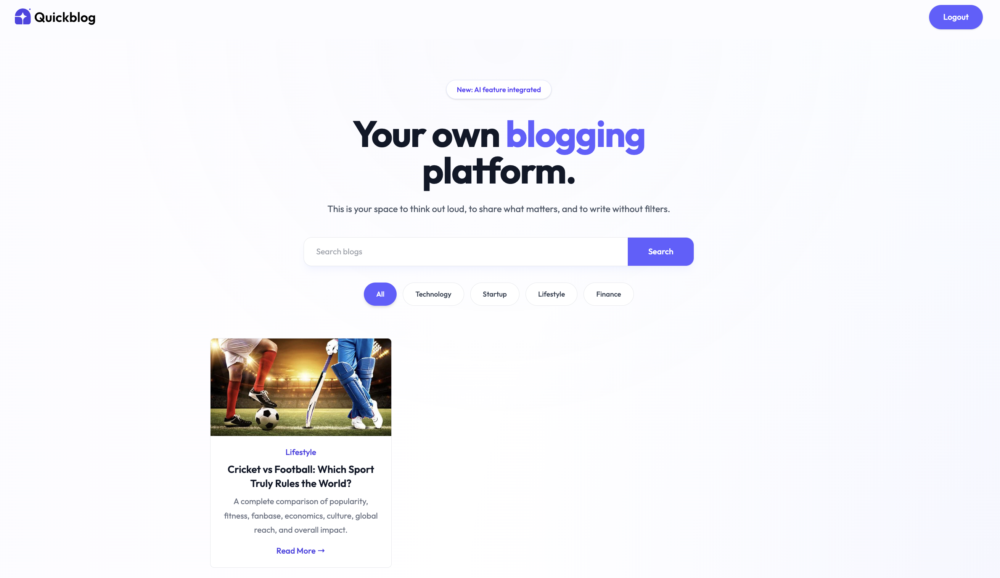
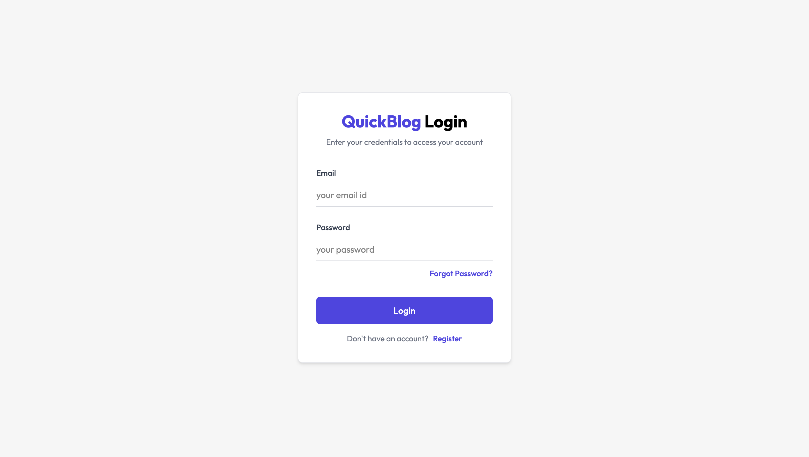
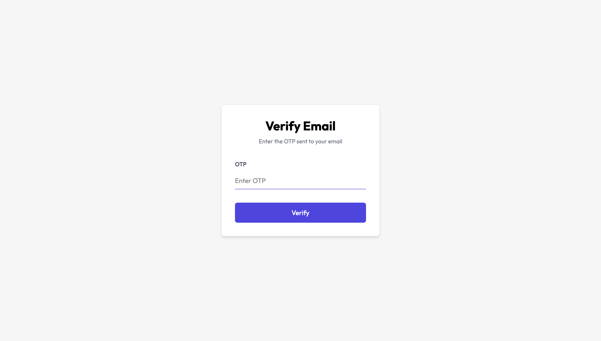
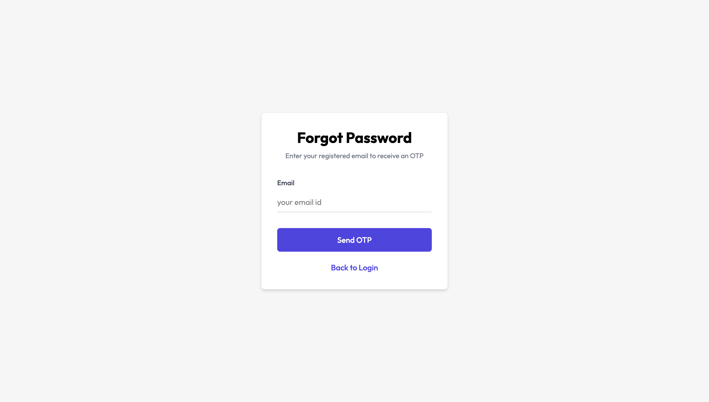
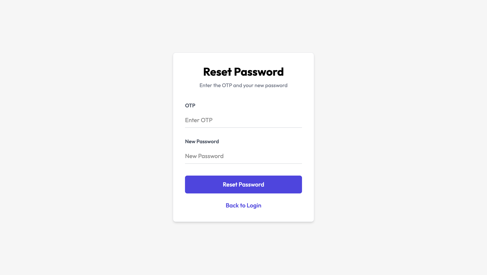
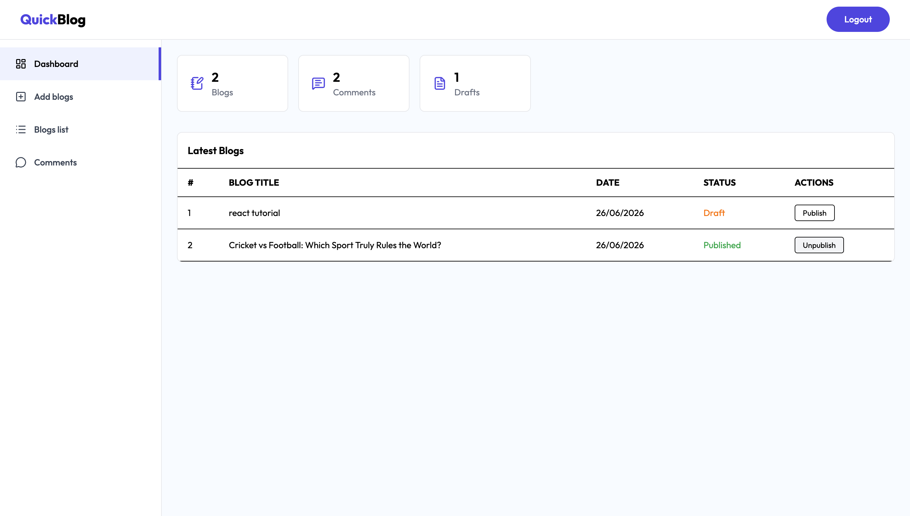
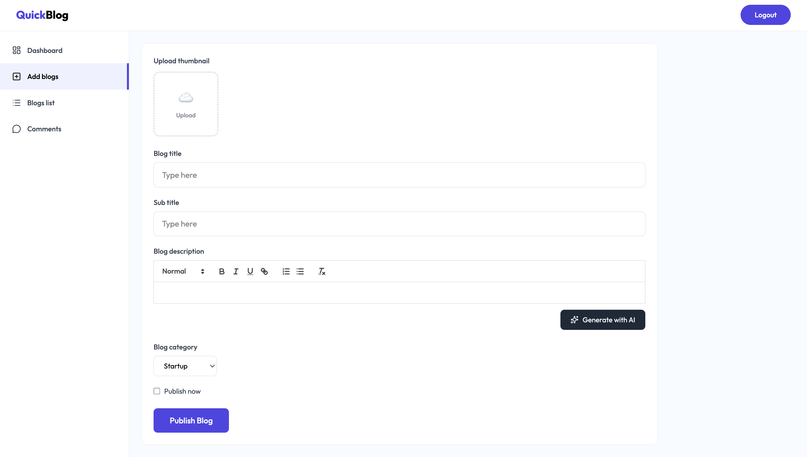
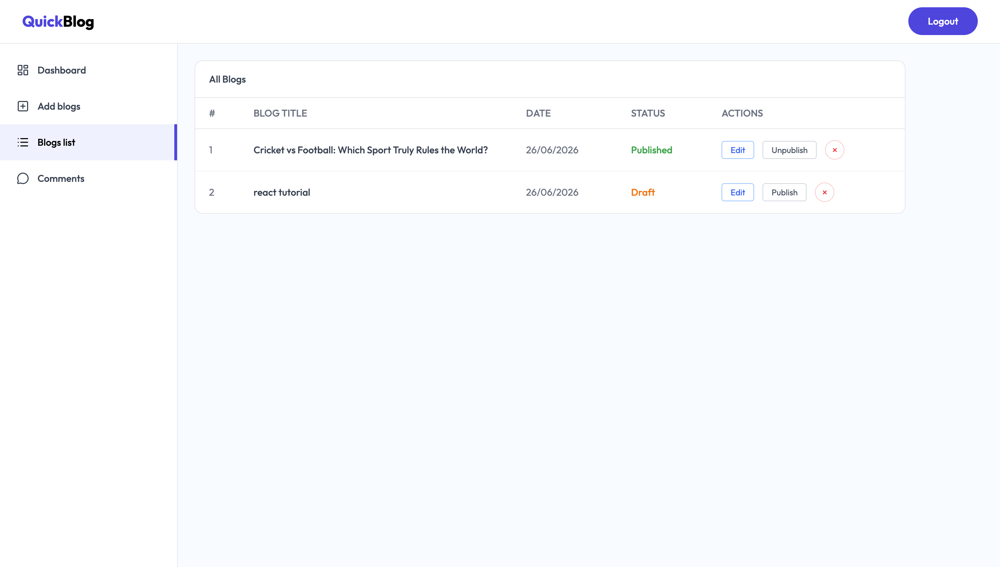
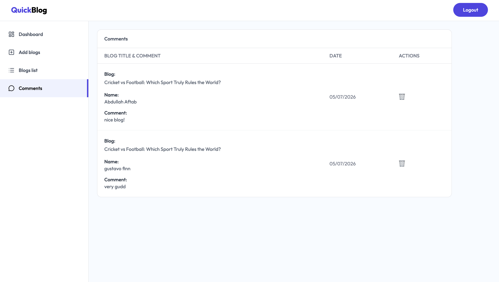

<div align="center">

# 🚀 QuickBlog

### A Full-Stack AI-Powered Blogging Platform built with the MERN Stack

Create, publish, manage, and explore blogs with AI-assisted content generation, secure authentication, email verification, password reset, image optimization, and an admin dashboard.

[](https://react.dev)
[](https://nodejs.org)
[](https://www.mongodb.com)
[](https://jwt.io)

</div>

---

# 🌐 Live Demo

### 👤 Client
🔗 https://quick-blog-lime-two.vercel.app

### 🛠️ Admin Dashboard
🔗 https://quick-blog-jvws.vercel.app

**Demo Credentials (Admin Dashboard)**

```text
Email: admin@gmail.com
Password: 123456
```

## 👤 Reader Demo Credentials

To quickly explore the client-side features without creating a new account:

**Email:** `demo.reader@quickblog.local`

**Password:** `ReaderPassword123`

You can use this account to:

- Read blogs
- Search and filter blogs
- Post comments
- Explore authenticated user features

> **Note:** This is a pre-configured demo account for portfolio evaluation. New account registration and password recovery on the live deployment use Resend's sandbox environment and may be unavailable for arbitrary email addresses.

### ⚙️ Backend API
🔗 https://quickblog-glbs.onrender.com

> **Note:** The backend is hosted on Render's free tier. If the API has been inactive, the first request may take 30–60 seconds while the service wakes up.

---

# 📌 Overview

QuickBlog is a production-ready, full-stack blogging application built using the MERN (MongoDB, Express, React, Node.js) stack. It bridges the gap between readers and content creators by providing a dual-application structure: a fast, responsive public website for readers, and a feature-rich, secure dashboard for administrators.

### Core Architecture highlights:
*   **Client Hub:** Readers can search and filter posts, read rich text formatted articles, and write verified comments.
*   **Admin Console:** Content managers can compose posts, toggle drafts, monitor performance statistics, and moderate discussion boards.
*   **AI Integration:** Leverages the Google Gemini API to instantly generate structured, SEO-friendly HTML content from a title and subtitle.
*   **Media Processing:** Implements a direct integration with ImageKit CDN for on-the-fly image format conversion and optimization.
*   **Authentication & Trust:** Multi-factor flow featuring email verification OTPs and password-reset triggers powered by the Resend Email API.

## 🏗️ Architecture Diagram

```text
                     +----------------------+
                     |  React Client/Admin  |
                     +----------+-----------+
                                |
                                |
                     +----------v-----------+
                     |    Express Backend   |
                     +----------+-----------+
                                |
        +-----------+-----------+-----------+-----------+
        |           |           |           |           |
        v           v           v           v           v
     MongoDB    Gemini AI   ImageKit    Resend API     JWT
```

---

# ✨ Features

## 👤 User Features

*   **Account Registration:** Secure user sign-up with server-side validations.
*   **Email Verification:** Instant verification using Resend API OTP generation.
*   **Credential Authentication:** Secure login using encrypted password validation.
*   **Secure Recovery:** Forgot-password and Reset-password pipelines validated by OTP codes.
*   **JWT Protected Sessions:** Automatic login persistency using secure local tokens.
*   **Category-based Discovery:** Fast filtration of articles by selected categories.
*   **Search Engine:** Live title search querying published articles.
*   **Interactive Comments:** Community commentary section under articles with real-time updates.

---

## 🛠 Admin Features

*   **Secure Admin Login:** Separate, restricted authentication workflow for admins.
*   **Analytical Dashboard:** Monitor core stats (total blogs, drafts, comments count) from a centralized grid.
*   **Content Manager:** Full CRUD interface for creating, viewing, updating, and deleting blog posts.
*   **Draft & Publish Workflows:** Toggle visibility instantly between unpublished drafts and live public articles.
*   **AI Assistant:** Integrated generation of article outlines and content structures directly in the editor.
*   **Cloud Storage & CDN:** Serverless image uploading using ImageKit APIs.
*   **Comment Moderation Panel:** Review global discussion boards and purge spam/toxic commentary.

---

## 🤖 AI Content Engine

Generate rich, structured, and SEO-optimized blog posts in seconds. Simply input:
*   **Blog Title**
*   **Blog Subtitle**

Google Gemini AI automatically outputs:
*   Structured layout with formatted headings
*   In-depth, readable content body
*   Semantic HTML output optimized for search indexing

---

## 📧 Authentication & Verification Flow

```
   [ Register Account ]
            │
            ▼
     [ Generate OTP ]
            │
            ▼
[ Send Email using Resend ]
            │
            ▼
     [ Verify Email ]
            │
            ▼
        [ Login ]
            │
            ▼
     [ JWT Token Issued ]
            │
            ▼
  [ Access Protected Routes ]
```

---

## 🧠 AI Blog Generation Flow

```
   [ Admin Input ]
   (Title & Subtitle)
          │
          ▼
 [ Google Gemini API ]
          │
          ▼
[ Structured HTML Body ]
          │
          ▼
   [ Edit & Review ]
          │
          ▼
    [ Publish Blog ]
```

---

# 🖥 Tech Stack

### Frontend & SPA Interfaces
*   **React 19** & **Vite** — Modular components and ultra-fast builds.
*   **React Router DOM** — Clean Single Page Application (SPA) routing.
*   **Axios** — Promised-based client communication with request interceptors.
*   **Tailwind CSS** — Clean, modern, utility-first UI design.
*   **React Hot Toast** — High-end responsive overlay toast alerts.
*   **React Quill** — WYSIWYG rich text editor for editorial content.

### Backend Restful API
*   **Node.js** & **Express.js** — Asynchronous, lightweight backend framework.
*   **MongoDB** & **Mongoose** — Document-oriented database storage and schema models.
*   **JWT (JSON Web Tokens)** — Stateless API security and user validation.
*   **BcryptJS** — One-way secure password hashing.
*   **Multer** — Middleware for handling multipart form data and file streams.

### External & Third-Party Services
*   **MongoDB Atlas** — Fully managed cloud database.
*   **Google Gemini AI API** — Advanced natural language processing models.
*   **ImageKit** — High-performance CDN for image uploads and optimizations.
*   **Resend Email API** — Reliable, transactional developer email API.
*   **Render** — Hosted backend REST web services.
*   **Vercel** — Fast, global hosting for React client and admin SPAs.

### Deployment

- **Frontend (Client):** Vercel
- **Frontend (Admin):** Vercel
- **Backend API:** Render
- **Database:** MongoDB Atlas

---

# 📂 Project Structure

```text
QuickBlog
│
├── admin/                  # Admin Dashboard React SPA
│   ├── src/                # Components, Pages, API handlers
│   └── public/             # Static administrative assets
│
├── client/                 # Public Blog React SPA
│   ├── src/                # Home, Blog views, Authentication layouts
│   └── public/             # Static reader portal assets
│
├── server/                 # REST Backend API
│   ├── config/             # DB & API connection setups (ImageKit, Resend)
│   ├── controllers/        # User, Admin, Blog, and Comment handlers
│   ├── middleware/         # Security guards and JWT decoders
│   ├── models/             # Mongoose MongoDB schemas
│   ├── routes/             # API routing endpoints
│   ├── utils/              # Token, OTP, and validation helpers
│   └── server.js           # Server startup script
│
└── README-assets/          # Product screenshots and visuals
```

---

# 📷 User Interface & Visual Showcase

### Home Page


---

### Blog Details


---

### User Authentication


---

### Two-Factor OTP Verification


---

### Password Recovery Flow


---

### Password Reset Page


---

### Admin Dashboard Analytics


---

### AI-Assisted Rich Text Creator


---

### Editorial List & Management


---

### Discussion Panel Moderation


---

## ⚙️ API Endpoints

### 👤 User Endpoints
*   `POST /api/user/register` — Register a new account (dispatches email OTP)
*   `POST /api/user/login` — Login user (returns JWT token)
*   `POST /api/user/verify-email` — Verify account using verification OTP
*   `POST /api/user/forgot-password` — Request password reset OTP
*   `POST /api/user/reset-password` — Set new password using reset OTP
*   `GET /api/user/profile` — Fetch authenticated user profile

### 📝 Blog Endpoints
*   `POST /api/blog/generate` — Generate blog post content using Google Gemini AI
*   `POST /api/blog/add` — Create and upload a new blog post (draft or published)
*   `GET /api/blog/all` — Retrieve all blog articles
*   `GET /api/blog/:id` — Retrieve an individual blog article by its ID
*   `PUT /api/blog/:id` — Update details or image of a blog article
*   `DELETE /api/blog/:id` — Delete a blog article

### 💬 Comment Endpoints
*   `POST /api/comment/add` — Post a comment on an article (authenticated)
*   `GET /api/comment/:blogId` — Retrieve all comments for an individual article
*   `GET /api/comment/all` — Fetch all comments (administrator view)
*   `DELETE /api/comment/:id` — Purge or delete a comment by ID

---

# ⚙ Environment Variables

To run the REST backend, create a `.env` file inside the `server/` directory:

```env
# Server Configuration
PORT=5000

# MongoDB Database Connection
MONGODB_URI=your_mongodb_atlas_uri

# Security Configuration
JWT_SECRET=your_jwt_signature_secret_key

# Default Administrator Account Configuration
ADMIN_EMAIL=admin@quickblog.com
ADMIN_PASSWORD=your_secure_admin_password

# ImageKit CDN Credentials
IMAGEKIT_PUBLIC_KEY=your_imagekit_public_key
IMAGEKIT_PRIVATE_KEY=your_imagekit_private_key
IMAGEKIT_URL_ENDPOINT=your_imagekit_url_endpoint

# Google Gemini API Key
GEMINI_API_KEY=your_gemini_api_key

# Resend Mail Service
RESEND_API_KEY=your_resend_api_key
SENDER_EMAIL=onboarding@resend.dev
```

---

# 🚀 Installation & Local Development

### 1. Clone the Repository
```bash
git clone https://github.com/Abdullah7-byte/QuickBlog.git
cd QuickBlog
```

### 2. Install Dependencies
Quickly install dependencies for the client, admin, and server directories:

```bash
# Install Server dependencies
cd server && npm install

# Install Client dependencies
cd ../client && npm install

# Install Admin dependencies
cd ../admin && npm install
```

### 3. Run the Applications

Open separate terminal windows or processes to spin up the local servers:

*   **Start the Backend Server (Port 5000)**
    ```bash
    cd server
    npm run server
    ```
*   **Start the Client Reader Webpage**
    ```bash
    cd client
    npm run dev
    ```
*   **Start the Admin Dashboard**
    ```bash
    cd admin
    npm run dev
    ```

---

# 📌 Future Improvements

- [ ] **User Profiles:** Allow users to update names, passwords, and profile pictures.
- [ ] **Interactive Likes:** Let authenticated readers like posts to boost visibility.
- [ ] **Reading List / Bookmarks:** Save articles for offline reading.
- [ ] **Dark Mode Toggle:** Smooth HSL-based theme switching.
- [ ] **Granular Access Control:** Introduce Editor, Moderator, and Owner permission scopes.
- [ ] **Metrics Analytics:** Tracking views and click-through statistics on blogs.
- [ ] **Social Authentication:** Secure OAuth integrations via Google, GitHub, or Twitter.
- [ ] **Markdown Editor Alternative:** Provide raw markdown toggle within the editor.
- [ ] **Reading Time Calculator:** Automatically compute reading times based on article length.
- [ ] **Newsletter Subscriptions:** Automatically email weekly digests via Resend API lists.
- [ ] **Pagination & Infinite Scrolling:** High-performance database pagination to improve loading speeds.
- [ ] **User Panel:** History logs of comments posted by user accounts.

---

# 📖 What I Learned

Building this project taught me several design principles and developer practices:
*   **Full MERN Integration:** Connecting disconnected user clients and admin control applications to a single REST interface.
*   **Secure API Pipelines:** Storing and retrieving credentials, hashing passwords using Bcrypt, and implementing JWT token guards.
*   **Third-Party API Architecture:** Integrating asynchronous generative services (Google Gemini) and cloud media hosting (ImageKit) without blocking server performance.
*   **Transactional Email Delivery using Resend API:** Dispatched verification OTP and recovery codes via clean email templates utilizing the Resend API.
*   **Environment Management:** Separating dev configs, storing sensitive keys securely, and managing CORS settings for Vercel/Render deployments.

---

# 👨‍💻 Author

## Abdullah Aftab

Aspiring Full-Stack Developer passionate about building scalable web applications using the MERN Stack. Interested in backend development, AI integrations, and solving real-world problems through software.

*   **GitHub:** https://github.com/Abdullah7-byte
*   **LinkedIn:** https://www.linkedin.com/in/abdullah-aftab-388b5b295/

---

# ⭐ Support

If you found this project helpful or learned something new, consider giving it a ⭐ on [GitHub](https://github.com/Abdullah7-byte/QuickBlog). It helps others discover the work!

